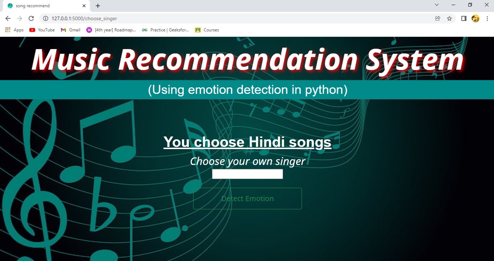

<h2 align="center">
  ANJALI KUMARI
   <a href="http://anjaliaks.github.io/Mysite/" target="_blank">🔗anjaliaks</a>
</h2>
 

<h3 align="center">
    🔹
    <a href="https://github.com/anjaliaks/anjaliaks.github.io/issues">Report Bug</a> &nbsp; &nbsp;
    🔹
    <a href="https://github.com/anjaliaks/anjaliaks.github.io/issues">Request Feature</a>
</h3>

You can fork this repo. Please give me proper credit by linking back to [anjaliaks](https://github.com/anjaliaks/anjaliaks.github.io). Thanks!

emoMusic is a Emotion Based Music Recommendation System webapp which can guess your emotion through your facial expressions and can recommend songs accoringly. 

# Tech Stack :

## Front-end
- HTML5
- CSS3
- Bootstrap

## Back-end
- Python

# Features

**📖 Multi-Page Layout**

**🎨 Styled with Bootstrap and Css**

**🧑 Detects emotion through facial expression**

**🎼 Recommends songs on YouTube according to your mood**

# Show your support

Give a ⭐ if you like this project!

# Result of this project

